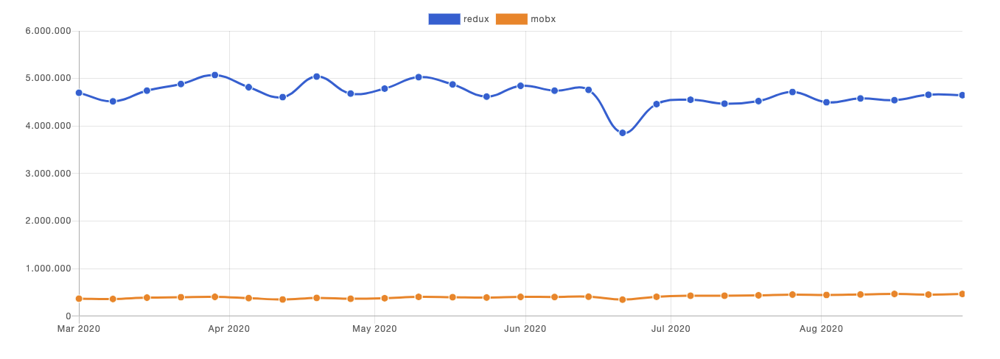
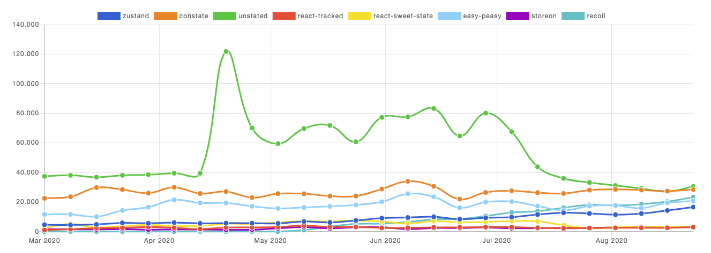
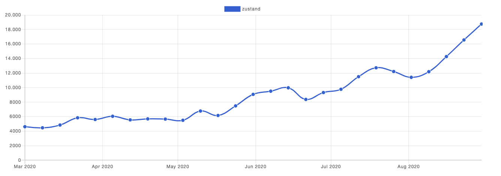
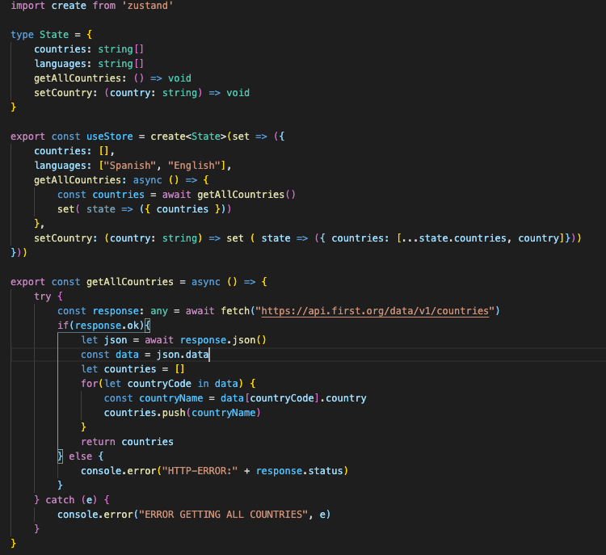
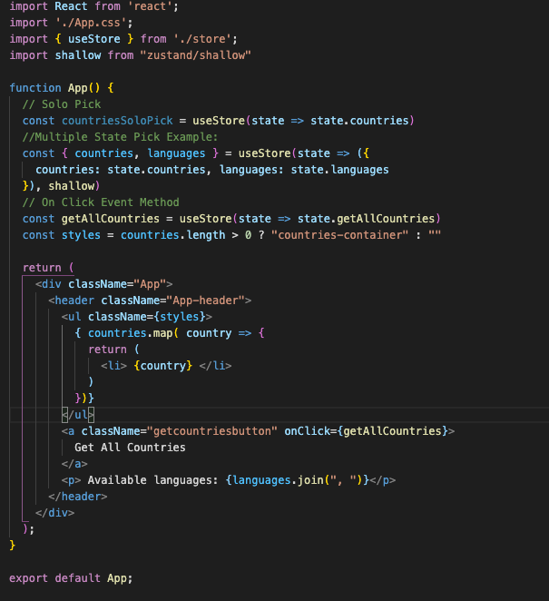
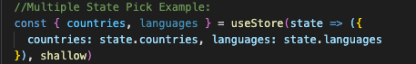

# Global State Management Research Blueprint

This research blueprint has the purpose of showing the most common and fresh global state management opportunities for reactjs.

## Index of content:

* Why do we need a global state management library?
* Which is the most installed library for this matter?
* Are there any other options available?
* Should we use Context API?
* Redux Comparison: Advantages & Disadvantages.
* Zustand: Simpler & Improved Global State Management Library.
	- What is Zustand?
	- Why should we pick it instead of Redux? Advantages & Disadvantages
	- Implementation Test using Zustand & Typescript
		- Creating the store
		- Setting sync values
		- Setting async values
		- Accesing data & event binding

## Why do we need a global state management library?

Most libraries like React, Angular, etc. are built with a way for components to internally manage their state without any need for an external library or tool. As the frontend application grows,  managing states shared across componentes becomes a nightmare. The data in a component should live in just one component, so sharing data among sibling components becomes difficult.

## Which is the most installed solutions for this matter?

*The most used library is redux* based on npmtrends. 
*Redux is a predictable state container for JavaScript apps.* The state of our whole application is stored in an object tree within a single store, which your app components depend on.  
Every component is connected directly to the global store, and the global store life cycle is independent of the components' life cycle.  
Another solution is Mobx. Both seem to be complex enough to look for alternatives.

## Are there any other options available?

After some research, the best libraries for state management in 2020 are by order of installations:

## Should we use Context API?

The Context API is great. It’s super easy to use compared to Redux and requires a lot less code, so why wouldn’t we use it?  
*The problem with context is simple: Everything that consumes a context re-renders everytime that context’s state changes.*  
That means that if you’re consuming your context all over the place in your app, or worse, using one context for your entire app’s state, you’re causing a ton of re-renders all over the place!  
Using useMemo doesn’t prevent rerenders on all components’ consumers.  
It would be needed several context Api providers to avoid rerenders on data mutation across the same context.

## REDUX Comparison: Advantages & Disadvantages

### Pros of using redux
* Central store, any component can access any state from the store, there’s no need of passing props back and forth.  
* Another way to look at centralised store, it persists the state of a component even after the component has unmounted.  
* Prevents unnecessary re-renders, as when the state changes it returns new state which uses shallow copy.  
* Testing will be easy as UI and data management are separated.  
* History of state is maintained which helps in implementing features like undo very easily.

### Cons of using redux:
* No encapsulation. Any component can access the data which can cause security issues.  
* Boilerplate code. Restricted design.  
* As state is immutable in redux, the reducer updates the state by returning a new state every time which can cause excessive use of memory.  
* Known issues while using redux:  
    - Stale Props & Zombie Children(*6): With hooks, there is no way to render a context provider, which means there's also no nested hierarchy of subscriptions. Because of this, the "stale props" and "zombie child" issues may potentially re-occur in an app that relies on using hooks instead of connect().

## Zustand: A Simpler & Improved Global State Management Library

### What is Zustand?

Small, fast and scaleable state-management solution. Has a comfy api based on hooks, that isn’t boilerplatey or opinionated, but still just enough to be explicit and flux-like.

### Why should we pick it instead of Redux? Advantages & Disadvantages

#### Advantages:

* Simple and un-opinionated
* Makes hooks the primary means of consuming state (Maria will love it!)
* Doesn't wrap your app in context providers
* Can inform components transiently (without causing render)
* Takes care of common problems using Redux or Reactjs:
    - Zombie child problem & stale props(*6)
    - React Concurrency (*7)
    - Context loss(*8)
    - Its growing!

#### Disadvantages:

* Smaller community compared to other existing solutions.
* There is a chance it gets unmaintained but judging by its growing, it looks like it is going to be there for the long term.

### Implementation Test using Zustand & Typescript:

#### Creating the store:
//store.ts  

The store is a hook! You can put anything in it: primitives, objects, functions.

#### Setting Sync Value:

The setCountry function takes a string parameter (representing a country name) and the set function merges the old state with the new one.

#### Setting Async Values:

getAllCountries trigger an async request to the network. After it resolves, it uses the set function to merge the states.

#### Accesing data & event binding
//app.tsx  

We simply use the hook useStore to get the part of the state that we need. In this case we get an array of countries and a method to trigger an async request.

#### Construct a single object with multiple state-picks inside:

Instead of pulling a single property of the global state, we can get multiple properties by telling zustand that we want the object to be diffed shallowly by passing an alternative equality function.

## Bibliography

1. *Global State Comparison:* https://github.com/dai-shi/lets-compare-global-state-with-react-hooks
2. *The problem with Context API:* https://leewarrick.com/blog/the-problem-with-context/
3. *Zustand Github:* https://github.com/react-spring/zustand
4. *Manage react state with Zustand:* https://phpnews.io/feeditem/manage-react-state-with-zustand
5. *Transient updates (for often occuring state-changes):* https://github.com/react-spring/zustand#transient-updates-for-often-occuring-state-changes
6. *Stale Props &  Zombie Child:* https://react-redux.js.org/api/hooks#stale-props-and-zombie-children
7. *React Concurrency RFC:* https://github.com/bvaughn/rfcs/blob/useMutableSource/text/0000-use-mutable-source.md
8. *Context loss in ReactJS:* https://github.com/facebook/react/issues/13332
9. *Zustand examples:* https://codesandbox.io/examples/package/zustand
10. *Flux pattern explained by facebook:* https://facebook.github.io/flux/docs/in-depth-overview/#:~:text=Flux%20is%20the%20application%20architecture,a%20lot%20of%20new%20code.
11. *Why not use Redux:* https://medium.com/@morgler/dont-use-redux-9e23b5381291#:~:text=Redux%20makes%20state%20changes%20explicit,a%20convention%2C%20not%20a%20library.